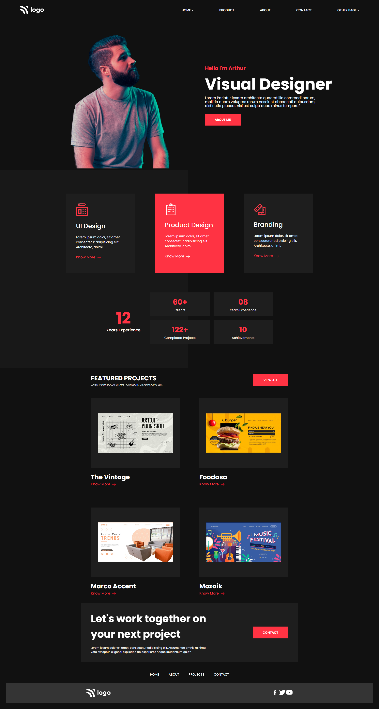

# Product Design Website Landing Page UI

`Name:` Rishabh Thakur

This is the User-Interface of Landing page of a product Design website designed fully with `HTML` and `CSS`. The web page is fully responsive. The Landing page contains:

 - Navbar
 - Header
 - Overview Section
 - Services Section
 - Footer

 # Learning Outcomes
  
  - Structuring `text` and `image` content for the web using `HTML5`.
  - Semantic `markup` new to the `HTML standard`.
  - Styling a web page using `Cascading Style Sheets (CSS)`.
  - Learnt the `inline and block model` for basic layout.
  - Learnt the `Flexbox model` for advanced layout.
  - Learn the `Grid model` for advanced layout.
  - Making the UI beautiful using CSS concepts.
  - Making responsive web pages using media queries

# Languages Used:
 ### HTML and CSS
  
 

 # Landing Page Screenshot

 

 # Time Taken to complete
`4 hours`

# Deployed Landing Page Link

[Product Website Landing Page](https://product-design-home-page.vercel.app)
***
